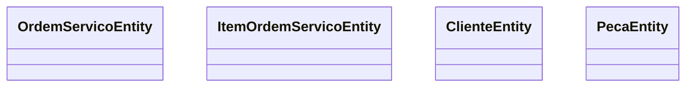

# Diagrama Automático de Entidades (placeholder)

Este arquivo será atualizado automaticamente quando o script completo for finalizado.

```mermaid
classDiagram
    class OrdemServicoEntity
    class ItemOrdemServicoEntity
    class ClienteEntity
    class PecaEntity
```
